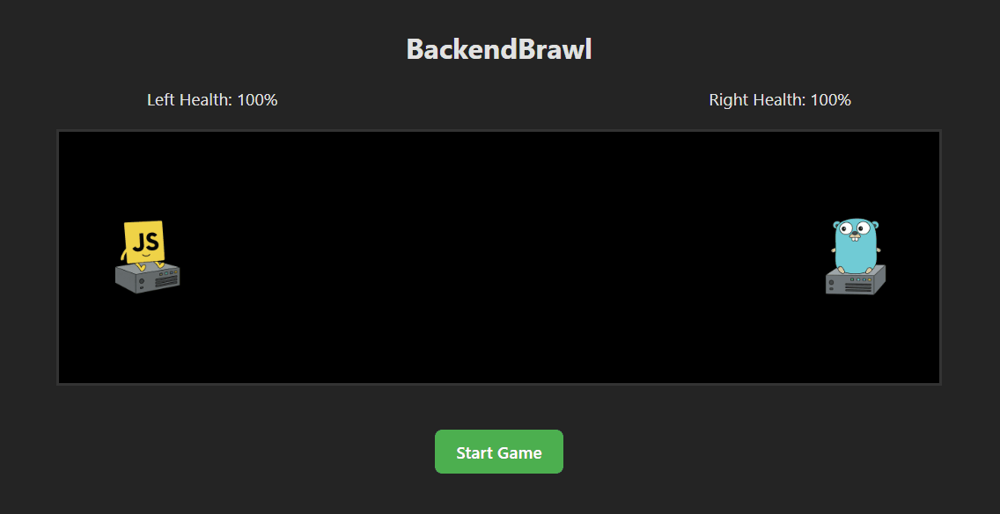

# ⚔️ BackendBrawl

**BackendBrawl** is a fun and visual simulation that pits two backend technologies — **Node.js** and **Golang** — against each other in a friendly battle of GET requests. It's not about proving which one is "better", but rather a creative way to observe how each handles high-frequency request traffic and interacts with a shared database.

> 💡 This project is a developer experiment, not a benchmark.

---

## 🧠 Concept

- Two backend servers: one built in **Node.js**, the other in **Go (Golang)**.
- A **controller server** triggers the simulation by sending a start signal.
- Upon start, both backends start sending GET requests to each other.
- Each server logs the timestamp of received requests into a **MongoDB** database.
- A **frontend app** (deployed on Vercel) reads these timestamps and animates a visual battle:
  - A request logged by Node.js = Node "fires" a bullet at Go.
  - A request logged by Golang = Go "fires" a bullet at Node.
- The bullets are fired based on the frequency and timing of logged requests, simulating a live duel.

---

## 🧩 Architecture

  

This animated diagram illustrates the flow between:
- **Node.js API** ↔ **Controller** ↔ **Golang API**
- All writing logs to a shared **MongoDB**
- The **Frontend** reads from the DB to animate the battle

---

## ⚙️ Technologies Used

- **Node.js** – Simulates one backend participant.
- **Go (Golang)** – Simulates the second backend participant.
- **MongoDB** – Stores all request logs with timestamps.
- **React** – Frontend UI for the simulation.
- **Framer Motion** – Animates the bullets and battle visuals.
- **Docker** – Containerized deployment.
- **Vercel** – Frontend deployment.
- **AWS EC2** – Hosts backend and controller services.

---

## 🌐 Live Demo

Check out the live simulation here: [Vercel App](https://backend-brawl.vercel.app/)

---

## 🧪 Why This Exists

While Node.js and Golang have different philosophies, this project shows:
- How asynchronous models (`async/await` in Node.js) compare to concurrency models (Go's `goroutines`) in a fun, visual way.
- That performance isn't everything — both ecosystems offer powerful tools depending on your project’s needs.

---

## 📸 Demo

---

## 📜 License

MIT License — use it freely, and have fun!